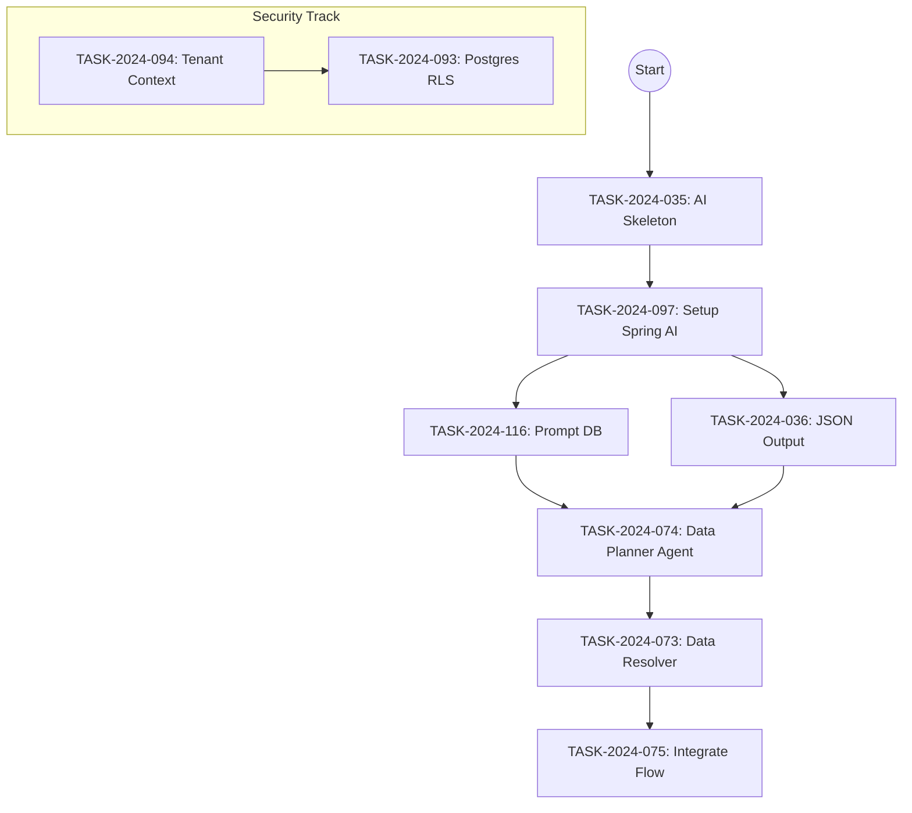

# План приоритезации задач (Roadmap)

## 1. Executive Summary & Стратегия

На основе проведенного аудита кодовой базы и архитектуры, проект находится в критической точке перехода от **MVP (Технический скелет)** к **Beta (Функциональный продукт)**.

**Текущие блокирующие факторы:**

1.  **Отсутствие `ai-service`:** Фронтенд (`AiWizard`, `SuggestionCard`) готов к взаимодействию с AI, но бэкенд-сервис отсутствует физически. Это блокирует ключевое ценностное предложение продукта (AI-генерация).
2.  **Технический долг по безопасности:** Использование `DEFAULT_TENANT_ID` во всех сервисах создает риск масштабного рефакторинга в будущем.

**Стратегия:**

1.  **Спринт 1 (AI Core):** Реализация "мозга" системы на Spring AI.
2.  **Спринт 2 (Security):** Активация мультиарендности (RBAC/RLS).
3.  **Спринт 3 (Orchestration):** Связывание сценариев в Suites.

---

## 2. Детальный план по приоритетам

### 🚨 Приоритет: CRITICAL (Немедленное исполнение)

_Цель: Заполнить архитектурный пробел `ai-service` и обеспечить работу уже реализованных UI-компонентов._

| ID Задачи           | Название                            | Обоснование (Architectural Rationale)                                                                                         |
| :------------------ | :---------------------------------- | :---------------------------------------------------------------------------------------------------------------------------- |
| **`TASK-2024-035`** | **Create AI Service Skeleton**      | В `docker-compose.yml` сервис заявлен, но папка `services/ai-service` отсутствует. Необходимо создать Spring Boot приложение. |
| **`TASK-2024-097`** | **Setup Spring AI & Agent Runtime** | (Обновленная) Подключение `spring-ai-ollama`, настройка `ChatClient` для модели `gpt-oss:20b`. База для всех агентов.       |
| **`TASK-2024-116`** | **Impl Prompt Management (DB)**     | (Новая) Реализация `PromptManager` и таблицы `ai_prompts`. Без этого агенты будут хардкодом.                                  |
| **`TASK-2024-036`** | **Structured Output Logic**         | Настройка `BeanOutputParser`. Критично для того, чтобы `orchestra-api` мог потреблять ответы AI как Java-объекты, а не текст. |
| **`TASK-2024-074`** | **DataPlannerAgent Implementation** | Реализация логики планировщика. Это "бэкенд" для уже готового UI `AiWizard.tsx`.                                              |

### 🔥 Приоритет: HIGH (Блокирует релиз)

_Цель: Устранить технический долг по безопасности и реализовать RAG._

| ID Задачи           | Название                         | Обоснование                                                                                                                            |
| :------------------ | :------------------------------- | :------------------------------------------------------------------------------------------------------------------------------------- |
| **`TASK-2024-094`** | **App-level Tenant Filtering**   | Замена `DEFAULT_TENANT_ID` на реальный механизм `TenantContext` (ThreadLocal) + RequestFilter. Чем дольше тянуть, тем сложнее править. |
| **`TASK-2024-093`** | **Postgres RLS Setup**           | Настройка Row-Level Security. Гарантия изоляции данных на уровне БД.                                                                   |
| **`TASK-2024-076`** | **Setup PGVector & VectorStore** | Подготовка инфраструктуры для RAG. Требуется для умного поиска данных (`Data Resolver`).                                               |
| **`TASK-2024-073`** | **Implement Data Resolver**      | Реализация компонента в `orchestra-api`, который выполняет план, сгенерированный AI.                                                   |
| **`TASK-2024-098`** | **Implement Tool Registry**      | Реализация Java-инструментов (`@Tool`), которые AI сможет вызывать (получение схем, поиск в БД).                                       |

### ⚠️ Приоритет: MEDIUM (Важно для функционала)

_Цель: Расширить возможности тестирования._

| ID Задачи           | Название                  | Обоснование                                                                                                                     |
| :------------------ | :------------------------ | :------------------------------------------------------------------------------------------------------------------------------ |
| **`TASK-2024-063`** | **SuiteRun Orchestrator** | Логика запуска группы сценариев. Сущности есть, контроллеры есть, но "движок" оркестрации зависимостей не обнаружен в Executor. |
| **`TASK-2024-064`** | **Executor Data Export**  | Передача данных между шагами (`outputContextDelta`). Нужно для сложных E2E сценариев.                                           |
| **`TASK-2024-032`** | **Report Analyst Agent**  | AI-анализ ошибок в отчетах. UI для этого есть (плейсхолдеры в `TestRunView`), нужен бэкенд.                                     |
| **`TASK-2024-039`** | **Mapping Agent**         | Помощь в сопоставлении BPMN задач и API эндпоинтов.                                                                             |

### 📉 Приоритет: LOW (Полировка)

_Цель: Эксплуатационная готовность._

| ID Задачи       | Название              | Обоснование                                                                              |
| :-------------- | :-------------------- | :--------------------------------------------------------------------------------------- |
| `TASK-2024-099` | Observability Logging | Структурированные логи. Важно для продакшена, но для разработки пока достаточно консоли. |
| `TASK-2024-100` | Metrics Export        | Prometheus метрики.                                                                      |
| `TASK-2024-103` | Admin UI              | Интерфейс для управления лимитами и пользователями.                                      |

---

## 3. Зависимости и критический путь

## 4. Рекомендации для команды

1.  **Не начинайте новые фичи UI**, пока не будет готов `ai-service`. Фронтенд сейчас опережает бэкенд в части AI.
2.  **При реализации `ai-service`:** Сразу закладывайте `TenantContext`. Если сейчас написать агентов без учета `tenantId` (например, при кэшировании промптов), потом придется переписывать.
3.  **Тестирование:** При реализации `Data Resolver` (TASK-2024-073) обязательно напишите интеграционные тесты с `Testcontainers` (Postgres + PGVector), чтобы проверить работу RAG.
